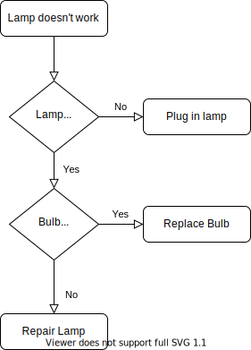

# Programming language chooser

## Prerequisites

Download CLIPS from http://www.clipsrules.net/Downloads.html

## How to run

Open CLIPS shell and type the following to run:

    (load lang.clp)
    (reset)
    (run)

`Ctrl+C` and then `Enter` to exit loop.

## Dialog on a diagram

